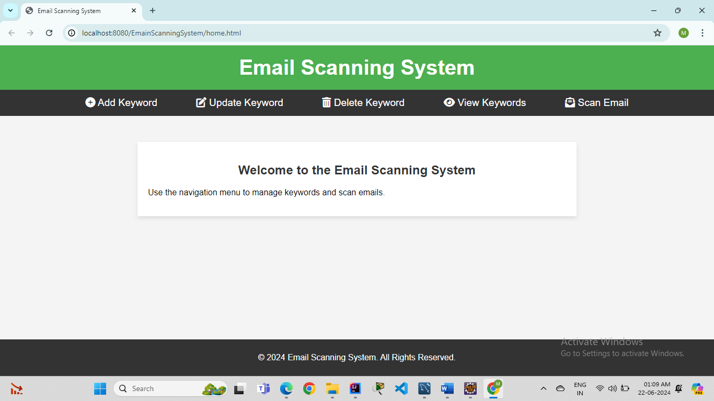
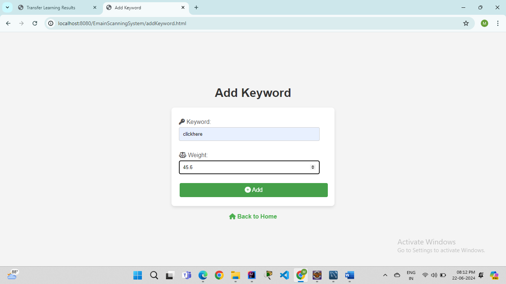
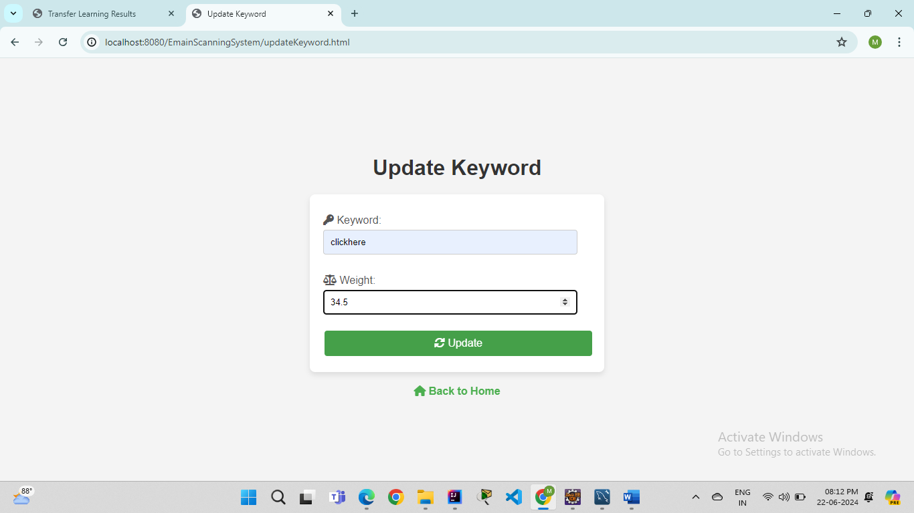
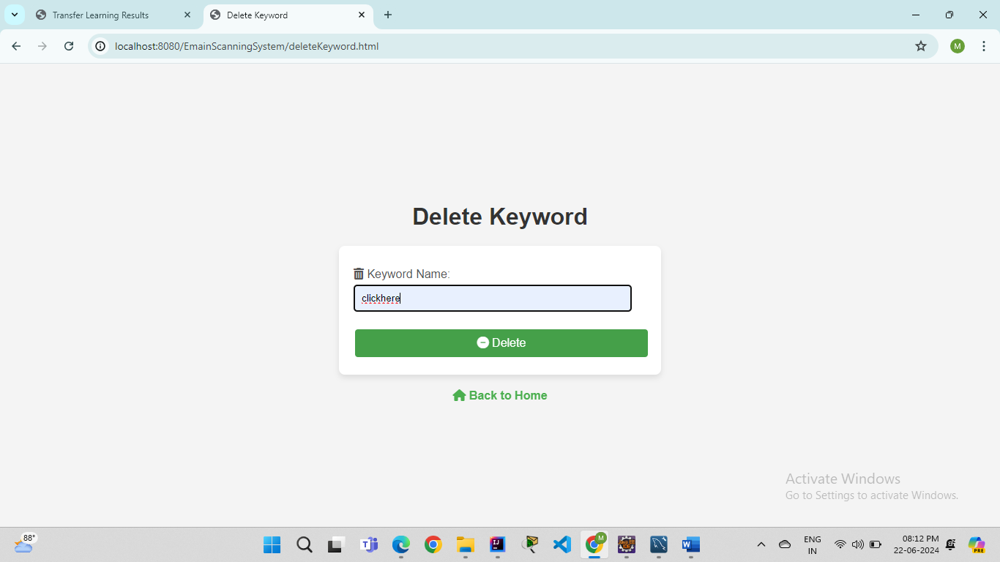
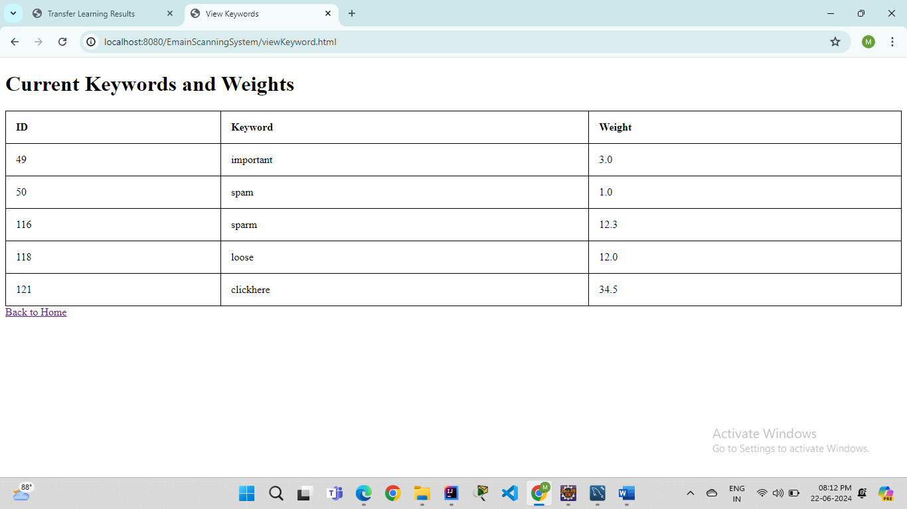
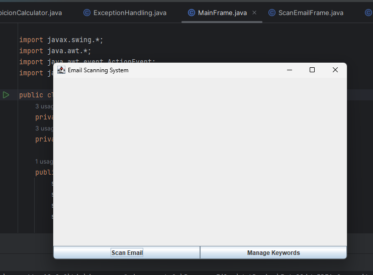
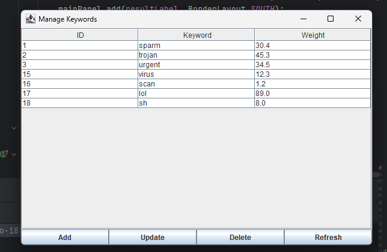
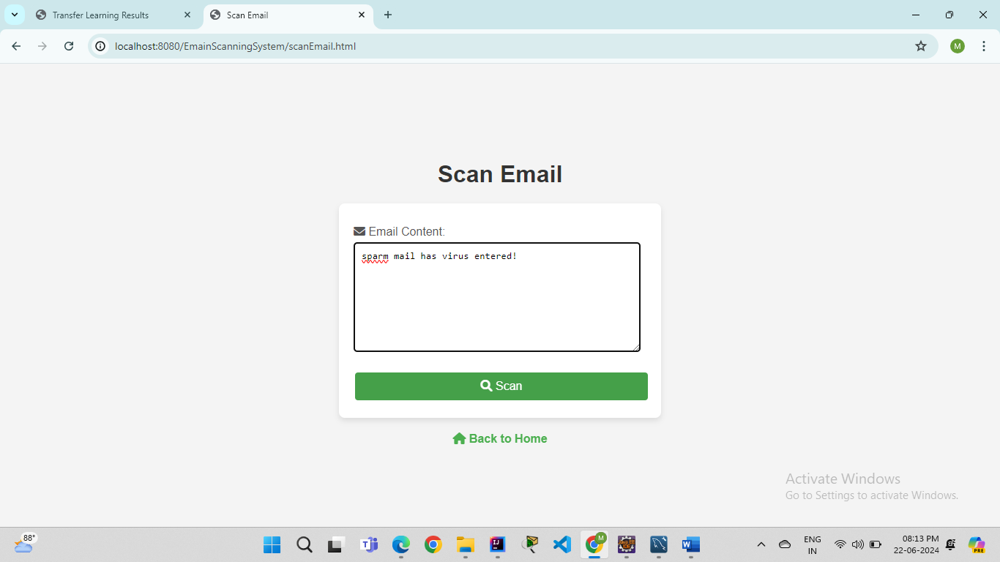
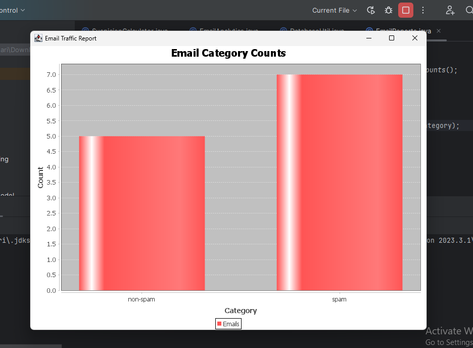

# Email Scanning System

## Overview

The Email Scanning System is a robust application designed to identify and categorize spam and non-spam emails. This project leverages keyword analysis and advanced reporting to enhance email security and provide detailed insights into email traffic patterns. The system includes keyword management, dynamic user interfaces, and strong security features, ensuring a comprehensive solution for managing email communications.

## Features

1. **Keyword Management**:
   - Add, update, and delete keywords with associated weights.
   - View all configured keywords and their weights.

2. **Email Scanning**:
   - Scan email content to determine the likelihood of spam based on keyword analysis.
   - Display the suspicion percentage with two decimal precision.

3. **Dynamic User Interface**:
   - Developed using Swing for a responsive and interactive user experience.
   - HTML pages styled with CSS for web-based management interfaces.

4. **Detailed Reporting**:
   - Generate detailed reports on email traffic and scan results.
   - Visualize data using charts and graphs with JFreeChart.
   - Export reports in PDF, Excel, or CSV formats.

5. **Security and Authentication**:
   - Implemented user authentication to restrict access based on roles.
   - Encrypted sensitive data for secure storage.
   - Ensured secure session management and protection against common vulnerabilities.

### Usage

#### Adding a Keyword

1. Open the `Add Keyword` page.
2. Enter the keyword and its weight.
3. Click the `Add` button to save the keyword.

#### Scanning an Email

1. Open the `Scan Email` page.
2. Paste the email content into the provided text area.
3. Click the `Scan` button to analyze the email and view the results.

## Results

### Keyword Management

### GUI componenets

### Scan Results

### Analysis

